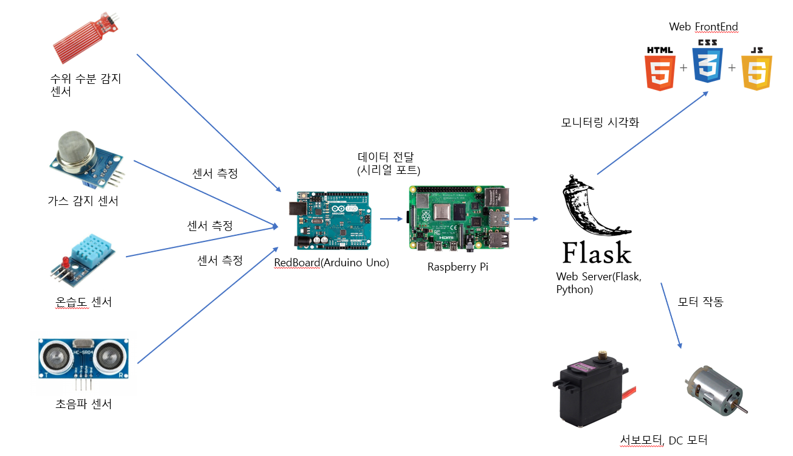
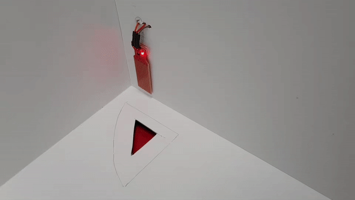

# TWBW The-World-Best-Warehouse
2020 IoT 디자인 캠프 해커톤 작품 (2020-08-10 ~ 2020-08-13)

## 소개
* 안전한 창고 내 관리를 위한 시큐리티 솔루션

## 기능(현재 구현된 기능)
* 온습도, 가스수치(메탄)이 일정 수치 이상 발생할 경우 공기청정기 작동
* 외부인 출입 시 초음파 센서를 이용해 감지를 하고 웹에 알람 설정
* 장마철에 폭우로 인한 창고 안에 물이 샐 경우 수위가 일정 수치 이상 일어나면 바닥의 문을 열어 물을 뺌

## 사용한 기술 및 장치
* HW
  * RedBoard(Arduino, Sensor System)
  * Raspberry Pi 3 B+ (Motor System, Main Server)
  * AWS S3(이미지 저장 서버)
* SW
  * Flask(WAS) - Python
  * Web FrontEnd(HTML, CSS, JavaScript+JQuery)
* Sensor
  * 초음파 센서 - 침입자 감지
  * DC 모터 - 환풍기
  * 서보모터 - 바닥 뚜껑
  * 온습도 센서 - 창고 내 온습도 측정
  * 가스센서(MQ-3) - 창고 내 가스(메탄) 검출
  * 수위 센서: 물 수위 측정
  
## 구현 문제점(해결해야 할 점)
* 레드보드(아두이노)와 라즈베리파이 간의 시리얼 통신 문제로 인한 원할한 데이터 통신이 불가
* 릴레이를 활용한 DC 모터의 작동

## 가능하다면 차기에 해결하거나 추가로 구현하고싶은 기능
* 레드보드 - 라즈베리파이 - Flask 간 통신 문제 해결
* 로그인과 DB를 이용한 1차 보안 기능 구현 + 관리자, 일반 사용자 분리
* 창고에서 보관하고자 하는 물품에 따라 관리 기준이 다르기 때문에 이에 대해 추가적인 조사 필요
* 카메라 모듈을 이용한 CCTV 기능 추가
* 안드로이드 어플리케이션 추가구현
* 창고 환경 데이터를 주기적으로 저장하여 원하는 조건에 환경변화를 분석하는 기능 추가
* 안전한 시스템 및 데이터 관리를 위한 클라우드, 네트워크 솔루션 필요

## 시스템 구성도

## 데모 영상
* 창고 안의 가스가 일정 수치 이상 들어갈 경우 환풍기 가동

* 물의 수위가 일정 이상 올라가면 밑의 구멍이 열리면서 물기를 제거(데모 당시 물 대신 터치로 대체)

* 웹 상에서의 수치 모니터링   

  
  
## TEAM MEMBERS 🧑🏻‍💻
|이름|역할|
|---|---|
|하정현|웹서버 구현|
|신주원|하드웨어 센서 테스트 및 모듈 구현|
|강혜리|하드웨어 및 회로도 제작|
|우승재|하드웨어 및 회로도 제작|
